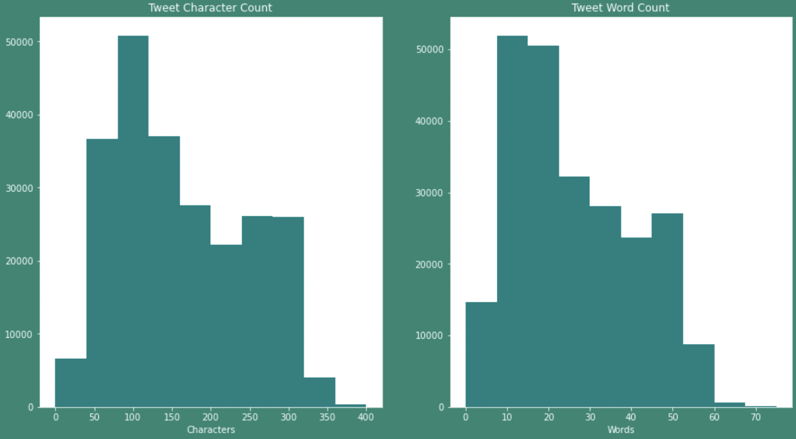
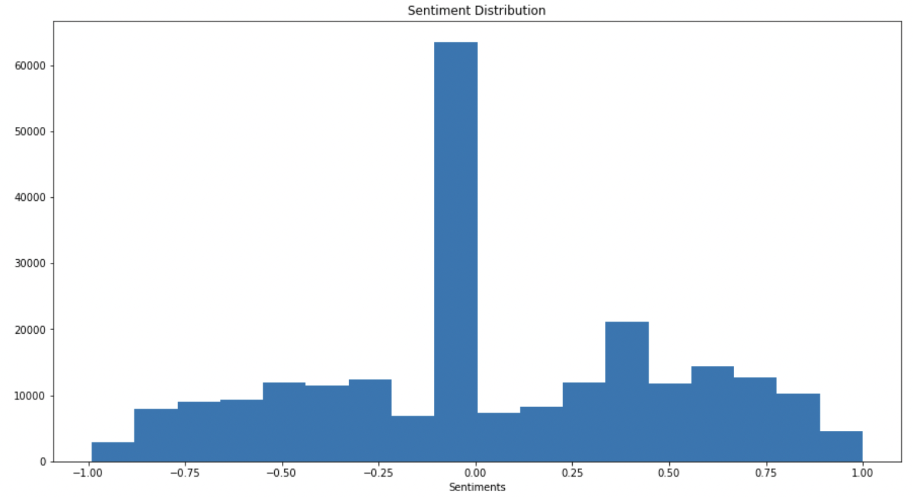
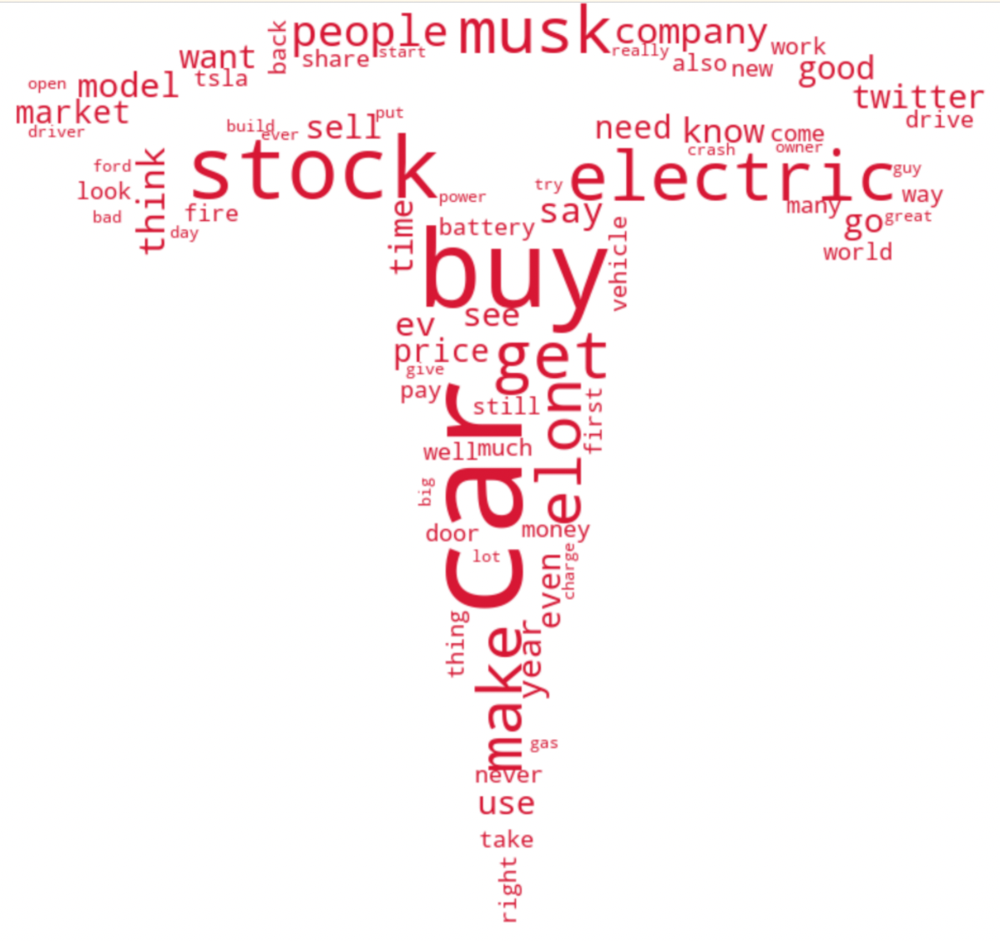
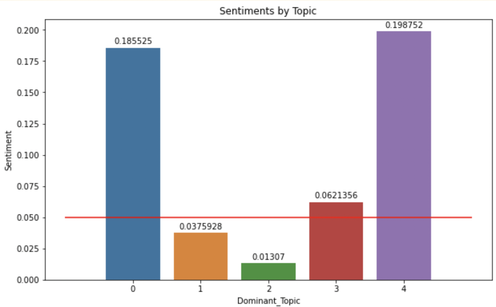
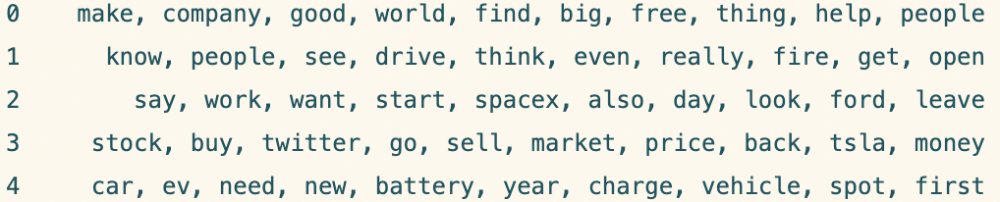

# Tesla-Perception-Audit
### An audit of the publics perception of Tesla Inc.

## Objective

The goal of this project is to identify to what extent public discourse and sentiment surrounding Tesla Inc. can be captured from social media data.  
From this;
- What topics within the discourse are most prominent?  
- In what ways are the company's public image lacking?  
- How can it be improved?  

# The Data, Preperation and EDA

## Data

The Data was sourced from the Twitter API, ranging from 5.9.2022 - 6.1.2022 

**Example Queries:**
- tesla
- tesla -@elonmusk
- tesla cars

## Preperation

Preprocessing steps were applied to each of the documents, these steps included:

- Removal of stop words
- Lemmatization, utilizing a Part of Speech tagging function to imporove quality and accuracy of lemmatization 
- Creation of bigrams and trigrams
- Tokenization
- Removal of tweets shorter than 5 tokens
- Removal of tokens appearing in less than 10 documents or in more than 95% of documents

## EDA

 **Document Lengths**

Initial EDA reveals a potential issue moving forward with the project; the documents are all quite short.

**Sentiment Distribution**

Exploring the distribution of document sentiments reveals the vast majority of documents have been given a sentiment of **0.00**
This, along with several other issues wihtin this project can be attributed to the data being made up of very short documents, made even shorter by the preprocessing steps to remove stop words and most / least frequent words. These short documents do not contain substantive information, resulting in perfectly neutral sentiments. 

And here's a cool WordCloud representing most frequent words within the data

## Useful Findings

### The results of the VADER Sentiment Analysis tool on each of the topic groups

**About VADER (Valence Aware Dictionary and sEntiment Reasoner)**

- Is specifically tuned to sentiments expressed on social media
- Senitments are on a scale of (-1. 1) with -1 representing most extreme negative and 1 representing most extreme positive
- (-0.05, 0.05) are considered neutral, neutrality has been indicated by the horizontal red line in the figure

### Most representative words of each topic, sorted using LDA

## Topic Interpretations 

- **Topic 0 Sentiment: 0.185**

These Keywords give a sense that the company Tesla Inc. is good for the world and helps people. 
This evaluation correlates to the sentiment value of the topic, being the second most positive of all the categories.  

- **Topics 1/2 Sentiments:  0.038/0.013**

Neither of these topics are particularly coherent, topic 1 has the words ‘get’, ‘open’, and ‘fire’ which could be referring to a Tesla car fire in which the door was stuck closed with the driver inside. If so, the topic is being discussed not only in a non-negative way but in a slightly positive neutral way. Topic 2 mentions SpaceX and Ford, both of which are entirely unrelated, with a very sentiment. 

- **Topic 3 Sentiment: 0.062**

A topic consisting of tweets concerning the relationship of both Tesla and Twitter to the stock market, 
Chatter related to twitter itself inevitably makes it’s way into the queries due to the link between Elon Musk, Tesla Inc. and Twitter.
This topic is slightly above neutral sentiment, notably not negative,  indicating no strong feelings in the aggregate surrounding Tesla’s and Twitters relationship with the stock market. 

- **Topic 4 Sentiment: 0.199**

A topic surrounding specifically Tesla’s electric vehicles
This topic is noticeably more positive than the others, indicating that in general discourse surrounding Tesla’s electric vehicles skews more positively

## Summary of Findings

Tesla inc.’s cars, stocks and positive impact dominated the discussion surrounding the company during the period in which the data was collected. We learned that the company’s positive impact and electric vehicles are discussed most positively although with the sentiment scale being (-1, 1) receiving a 0.2 is still not amazing. 

We suggest the company focus on emphasizing their positive contributions to society. There is alredy a general feeling of positivity surrounding Tesla Inc. and it's most important product, cars. This feeling can be emphasized and promoted to attract more customers. 

Notably, Tesla's other product lines, like solar energy, did not come up during the investigation of discourse. It is important for the company to ensure the public is aware that the company is involved in other industries which can also be positively associated with the Tesla. 

We should also note that an incident in which a Tesla vehicle caught fire, trapping a passenger inside, made a ripple in online discussion. Although the topic was not evaluated to be being discussed in a negative way, this incident could reduce a potential customer’s confidence in the vehicles, raising questions about safety. This issue should be addressed directly. 

